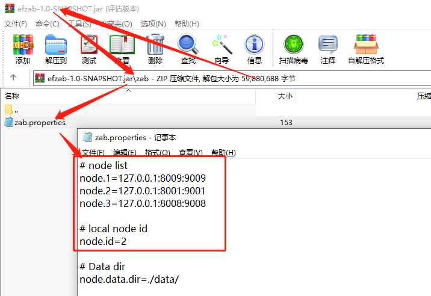
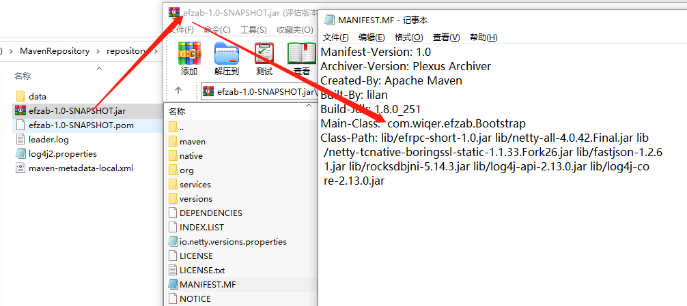

# efzab

## 介绍

efzab是仿照zookeeper思路实现的zab协议


#### efzab功能介绍

tcp短连接实现的zab半数决议协议

#### efzab架构简介

分布式事务整体角色分为 服务端（观察者 （LOOKING） ，（主）LEADING,（从）FOLLOWING），客户端

集群特性：

服务端数量无限制，客户端亦然

#### efzab开发框架

Java+Netty

## 软件架构


## 安装教程

maven打包即可

## 使用说明
修改ip端口号

这里 node.id从1取到3
```
# node list
node.1=127.0.0.1:8009:9009
node.2=127.0.0.1:8001:9001
node.3=127.0.0.1:8008:9008

# local node id
node.id=2
```



修改为

Main-Class:  com.wiqer.efzab.Bootstrap
linux/win命令都是如下（注意java环境变量）：
java -jar com.wiqer.efzab.Bootstrap.class


## 实现原理
zab三阶段过半数持久化协议
## 致敬
zookeeper

